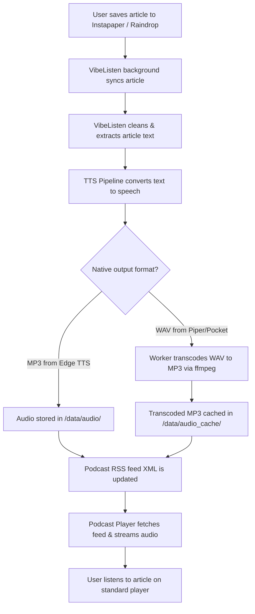

# Product Requirements Document (PRD)
## Project: VibeListen (Read-it-Later Podcast Generator)

---

### 1. Executive Summary & Vision

**VibeListen** is a self-hosted, lightweight utility that automatically bridges the gap between text-based "read-it-later" services (such as Instapaper and Raindrop.io) and audio-based podcast players (such as Overcast, Pocket Casts, and Apple Podcasts). 

The goal of VibeListen is to convert saved text bookmarks into highly natural speech audio files and serve them via a standard, secure podcast RSS feed. This allows users to listen to their personal reading list on the go using their standard podcast app, with support for local offline-first TTS generation (using state-of-the-art models like Kyutai Labs' **Pocket TTS** and **Piper TTS**) or zero-config cloud-based options.

---

### 2. User Journey & Use Cases



#### Key Use Cases
*   **Commuting & Multi-tasking**: Listen to long-form journalism, technical blog posts, or essays while driving, walking, or doing chores.
*   **Local & Private Synthesis**: For privacy-conscious users, perform all TTS processing on a local CPU (using Pocket TTS or Piper) without sending contents to third-party APIs.
*   **Zero-Setup Out-of-the-Box**: Quick onboarding using cloud-based free synthesis (Edge TTS) and simple tokens before configuring heavier local ML pipelines.
*   **Standard Podcast client integration**: No custom player app needed; works instantly with existing podcast clients via a private RSS link.
*   **Secure Self-Hosting**: API authentication, CSRF protection, rate limiting, credential encryption at rest, and SSRF/DNS rebinding protection ensure safe deployment on public networks.

---

### 3. Read-it-Later Service Integrations

To get articles, VibeListen will support multiple services. The following table compares integrations to help the user choose their backend:

| Metric / Feature | **Instapaper** (User Choice) | **Raindrop.io** (Recommended Alternative) |
| :--- | :--- | :--- |
| **API Ease of Use** | **Medium-Hard**: Full API requires OAuth 1.0a with custom HMAC-SHA1 signatures. | **Excellent**: Simple REST API using static personal "Test Tokens" created in 5 seconds. |
| **Developer Access** | **Restricted**: Requires submitting a web form for `Consumer Key` and waiting for manual approval. | **Instant**: Developer console is open and accessible immediately under account settings. |
| **Article Extraction**| Standard HTML or text. Requires third-party scraper for full content if using bookmark sync. | **Built-in**: Raindrop parses and stores clean text, HTML, and markdown of articles out-of-the-box. |
| **RSS Feeds** | Available for premium users, but text-only, not audio-friendly. | Has built-in public and private RSS feeds of folders/collections. |

> [!TIP]
> **Recommendation**: While we will support **Instapaper** as requested, we strongly recommend implementing **Raindrop.io** as the default or first integration due to its instant developer access, personal token system, and built-in full-text parser. We will construct a pluggable integration adapter that supports both!

---

### 4. Text-To-Speech (TTS) Engine Architecture

VibeListen will implement a pluggable audio synthesis system. Users can toggle between three engine tiers in their settings:

#### A. Pocket TTS (Kyutai Labs)
*   **Type**: Offline, local neural TTS (Continuous Audio Language Models - CALM framework).
*   **Specs**: 1.6B parameter model (Moshi TTSModel with 32 quantizers), GPU-accelerated (CUDA when available), also runs on CPU.
*   **Special Feature**: **Voice Cloning** — can clone any voice from a 5-second WAV reference audio file (perfect for matching your own voice, or your favorite narrator).
*   **Pros**: Incredible naturalness, offline privacy, multilingual support (EN, FR, DE, ES, PT, IT).
*   **Cons**: Requires Python ML setup (PyTorch/ONNX dependencies).

#### B. Piper TTS
*   **Type**: Offline, fast local neural text-to-speech.
*   **Specs**: ONNX runtime-backed, optimized for low-end hardware (Raspberry Pi 4 / standard CPU).
*   **Voices**: Extremely diverse library of hundreds of pre-trained voices across multiple languages/accents.
*   **Pros**: Fast execution, zero internet required, extremely stable CLI and Python library integration.
*   **Cons**: Voices sound more mechanical than Pocket TTS, lacks built-in zero-shot voice cloning.

#### C. Edge TTS (Alternative option)
*   **Type**: Online, cloud-based free text-to-speech.
*   **Specs**: Leverages Microsoft Edge's hidden Read-Aloud API via python wrapper `edge-tts`.
*   **Pros**: **Zero configuration**, incredibly high-quality neural voices, extremely fast, completely free, requires no model downloads or heavy PyTorch installations.
*   **Cons**: Requires active internet connection, sends article text to Microsoft servers.

---

### 5. Technical Stack & Architecture

#### Core Tech Stack
1.  **Backend & Pipeline**: **Python 3.13+ (FastAPI)**
    *   *Why?* The local ML engines (Piper, Pocket TTS) are Python-native or Python-friendly. Using FastAPI provides a high-performance web server, simple background tasks for audio generation, and easy SQLite interfacing.
2.  **Database**: **SQLite** with **SQLAlchemy/SQLModel**
    *   To keep the app self-contained, lightweight, and zero-config.
3.  **Frontend Dashboard**: **Vanilla JS + CSS**
    *   *Why?* Sleek, high-performance interface. Vanilla JS and raw CSS with glassmorphism aesthetics keep the application extremely portable and fast to serve directly from the FastAPI backend.
4.  **Audio Processing**: **Raw WAV / MP3 handling** (pydub unavailable on Python 3.13+)
    *   TTS engines output native formats: Edge TTS produces `.mp3`; Piper and Pocket TTS produce `.wav` directly.
    *   **Transcoding Pipeline**: WAV files from Piper/Pocket are transcoded to MP3 by the background worker via `ffmpeg` (using `libmp3lame` at configurable bitrate). This ensures maximum compatibility with podcast client apps that may not support WAV playback.
    *   **Transcoding DoS Prevention**: `ffmpeg` is only invoked by the background worker — never by the HTTP endpoint. The `/rss-audio/` endpoint serves only pre-cached MP3 files, preventing CPU-exhaustion attacks via on-demand transcoding.

#### Directory & Data Flow
*   **`/audio/`**: Serves generated audio files (`.mp3` from Edge, `.wav` from Piper/Pocket).
*   **`/audio_cache/`**: Stores transcoded MP3 copies of WAV files (produced by background worker via `ffmpeg`).
*   **`/rss-audio/`**: Serves pre-cached MP3 files for podcast feed enclosures (never spawns transcoding on-demand).
*   **`/rss.xml`**: Dynamically serves the podcast feed with `<enclosure>` URLs pointing to `/rss-audio/` (for WAV sources) or `/audio/` (for MP3 sources).
*   **`/db.sqlite`**: Stores bookmarks, sync times, and configuration settings (secrets encrypted at rest via Fernet).

---

### 6. Functional & Non-Functional Requirements

#### Feature 1: ✅ The Sync & Extraction Engine (Backend) *(Completed in v0.6)*
*   **Polled / Triggered Sync**: Connects to the Instapaper (OAuth 1.0a) and/or Raindrop.io (Bearer Token) APIs and fetches new bookmarks.
*   **Article Parser**: Using `readability-lxml` and `beautifulsoup4`, extracts the core text body, removing navigation panels, ads, social sharing widgets, and headers.
*   **SSRF Protection**: URL validation blocks internal/private IPs and eliminates DNS rebinding TOCTOU (single-resolution pattern with `Host` header override).
*   **Resilience**: `tenacity` retry with exponential backoff on all external API calls. Separate connect (10s) / read (30s) timeouts.
*   **N+1 Prevention**: Single `SELECT` fetches all existing IDs before the sync loop.
*   **Content Chunking**: Articles are split at word boundaries for Piper TTS (max 2000 chars per chunk). Edge and Pocket handle full articles natively.

#### Feature 2: Audio Synthesis Pipeline (Backend)
*   **Job Queue**: Processes text-to-speech tasks in a background worker loop with adaptive polling (idle backoff 2s → 30s).
*   **Stitched Intros**: Prepends a short programmatic intro: *"Welcome to VibeListen. Reading: [Title] by [Author], published in [Domain]."*
*   **Native Output**: Each TTS engine produces its native format — `.mp3` from Edge, `.wav` from Piper and Pocket.
*   **Transcoding**: WAV files are transcoded to MP3 by the background worker via `ffmpeg` (`libmp3lame`, configurable bitrate). This ensures podcast app compatibility without exposing on-demand transcoding to the HTTP layer.
*   **Transcoding Cache**: Transcoded MP3s are stored in `/data/audio_cache/` and served through the `/rss-audio/` endpoint.

#### Feature 3: Podcast Feed Server
*   **Standard Compliance**: Generates a valid RSS 2.0 feed complying with iTunes/Apple Podcasts standards (built via `xml.etree.ElementTree`).
*   **Enclosures**: Includes `<enclosure>` tags with absolute HTTP URLs. WAV-based items point to `/rss-audio/<id>.mp3` (transcoded MP3), while Edge-generated items point directly to `/audio/<id>.mp3`.
*   **ETag Caching**: RSS feed supports `ETag` / `If-None-Match` headers for efficient polling.
*   **External Access**: Provides instructions on using tunneling services (e.g. `ngrok`, `localtunnel`, or `Tailscale`) so podcast apps on mobile phones can download and stream audio from the local machine.

#### Feature 4: ✅ Premium Web Dashboard (Frontend) *(Completed in v0.6)*
*   **Visual Style**: Sleek modern dark mode using deep HSL color gradients, glassmorphism panel backgrounds, and crisp modern typography (Outfit / Inter).
*   **Active Bookmark Feed**: View synced bookmarks with cards indicating status (`Unprocessed`, `In Queue`, `Synthesizing`, `Ready to Listen`, `Failed`).
*   **Manual Trigger**: Click "Regenerate" or "Sync Now" buttons.
*   **Audio Player**: Sleek embedded HTML5 custom audio player with playback speed controllers (1.0x, 1.25x, 1.5x, 2.0x).
*   **Settings Panel**: 
    *   Configure APIs (Instapaper credentials or Raindrop test tokens).
    *   Choose TTS Engine (Pocket TTS, Piper, Edge TTS) with automatic unavailable-engine detection.
    *   Drop-down list of available voices (fetched dynamically).
    *   Upload Reference Audio (5s WAV) for Kyutai Pocket TTS voice cloning.
    *   One-click "Copy RSS Feed URL".
*   **Performance**: Targeted DOM updates via card map diffing (no full re-renders). Auto-polling at 5s intervals when active synthesis jobs are detected.
*   **Security**: All API requests include `X-API-Key` and `X-Requested-By` headers. Domain field escaped to prevent stored XSS.

---

### 7. Proposed System Architecture

```
                    +------------------------------------+
                    |        External Services           |
                    |  - Instapaper API (OAuth 1.0a)    |
                    |  - Raindrop.io API (Bearer Token) |
                    +-----------------+------------------+
                                      |
                                      v
+-----------------------------------------------------------------------+
|                     VibeListen Backend (FastAPI)                        |
|                                                                       |
|  +------------------+   +------------------+   +--------------------+ |
|  | Security Layer   |   | Bookmark Syncer  |-->| Content Parser     | |
|  | - API Key Auth   |   | (Raindrop +      |   | (readability-lxml, | |
|  | - CSRF Protect   |   |  Instapaper)     |   |  SSRF validated)   | |
|  | - Rate Limiting  |   +------------------+   +---------+----------+ |
|  | - Fernet Crypto  |                                      |          |
|  | - SSRF/DNS       |                           +---------v--------+ |
|  | - Settings Valid.|                           |  SQLite DB (WAL)  | |
|  +------------------+                           |  (SQLModel)       | |
|                                                 |  Secrets Encrypted| |
|                                                 +--------+---------+ |
|                                                          |           |
|  +-------------------------------------------------------+           |
|  |                                                                   |
|  v                                                                   |
|  +--------------------+   +---------------------+   +--------------+ |
|  |  Audio Pipeline    |-->| TTS Adapter         |-->| Local Audio  | |
|  |  (Background       |   | (Pocket/Piper/Edge) |   | Store (.mp3/ | |
|  |   Worker - Async)   |   |                     |   |  .wav)       | |
|  +--------+-----------+   +---------------------+   +------+-------+ |
|           |                                                        |
|           v                                                        |
|  +--------------------------+    +---------------------------+     |
|  | ffmpeg Transcoding       |--->| Audio Cache               |     |
|  | (WAV -> MP3, in worker)  |    | (/data/audio_cache/ .mp3) |     |
|  +--------------------------+    +------------+--------------+     |
|           |                                             |          |
|           v                                             v          |
|  +--------------------+                      +-------------------+ |
|  | RSS XML Generator   |                      | Static Server     | |
|  | (xml.etree.Element- |                      | (/frontend,       | |
|  |  Tree, ETag support)|                      |  /audio,          | |
|  +--------+-----------+                      |  /rss-audio)      | |
|           |                                   +--------+----------+ |
+-----------|--------------------------------------------|------------+
            | (Serves RSS Feed)                          | (Serves audio & UI)
            v                                            v
+----------------------------+                +------------------------+
|  Standard Podcast Client   |                | Sleek Web Dashboard    |
|  (Overcast, Pocket Casts,  |                | (Glassmorphism UI,     |
|   Apple Podcasts)          |                |  Inline Audio Player,  |
+----------------------------+                |  Settings Management)  |
                                               +------------------------+
```

---

### 8. Phased Implementation Roadmap

#### **Phase 1: Foundation & Simple Cloud MVP (Fastest Path)**
*   Setup basic Python FastAPI project layout.
*   Implement Raindrop.io sync with personal access token (e.g. Test Token) as the default provider.
*   Integrate `newspaper3k` or `readability-lxml` for clean text parsing.
*   Integrate **Edge TTS** (zero-config, high quality) as the initial audio pipeline.
*   Write basic dynamically generated `rss.xml` builder.
*   **Outcome**: User can subscribe to feed on their local network or via ngrok, fetch Raindrop bookmarks, generate audio, and listen on standard podcast player.

#### **Phase 2: Local AI TTS Integration (Piper & Pocket TTS)**
*   Implement pluggable TTS adapter system.
*   Integrate **Piper TTS** with model auto-downloading helper.
*   Integrate **Kyutai Labs Pocket TTS** (with optional 5-second reference voice cloning configuration).
*   Add a local background process queue to handle heavier CPU audio generation.
*   **Outcome**: Zero-internet, completely offline-capable audio generation with custom voice cloning.

#### **Phase 3: ✅ Additional Read-it-Later Providers (Instapaper)** *(Completed in v0.6)*
*   Implement OAuth 1.0a flow and API integration for **Instapaper** full bookmark, sync, and extraction support.
*   Design a pluggable read-it-later integration adapter pattern to easily scale to future backends.
*   **Outcome**: Full support for both Instapaper and Raindrop.io read-it-later systems.

#### **Phase 4: Optimization, Multi-Platform & Packaging**
*   Add Dockerfile for easy multi-arch deployments (x86 and ARM64/Raspberry Pi).
*   Incorporate automatic audio trimming, silence removal, and background sound mixing.
*   Setup simple scripts for tailscale or ngrok setup guides.
*   **Outcome**: High performance, easy multi-device deployment, and robust production delivery.

#### **Phase 5: ✅ Premium UI Web Dashboard** *(Completed in v0.6)*
*   Create a jaw-dropping glassmorphism dashboard in Vanilla CSS/JS (styled to look like a premium SaaS application).
*   Add responsive layouts for desktop and mobile.
*   Build an interactive local player, live logs visualizer, and settings management forms.
*   **Outcome**: A polished, beautiful, self-contained app ready for self-hosting with rich, intuitive controls.

#### **Phase 6: ✅ Security Hardening & Performance Optimization** *(Completed in v0.6)*
*   API authentication (`X-API-Key`), CSRF protection (`X-Requested-By`), and rate limiting (`slowapi`).
*   Credential encryption at rest via Fernet (separate `ENCRYPTION_KEY` from `SECRET_KEY`).
*   SSRF / DNS rebinding protection with single-resolution pattern and `Host` header override.
*   Settings validation with allowlist and length limits (`backend/schemas.py`).
*   SQLite WAL mode + `busy_timeout` + index on `Bookmark.status` for concurrent performance.
*   N+1 query elimination in sync loop; bulk settings API.
*   Adaptive worker polling with idle backoff (2s → 30s).
*   WAV-to-MP3 transcoding in background worker (DoS prevention).
*   Stored XSS prevention, generic error responses, RIFF header validation on uploads.
*   HTTP connection pooling with `requests.Session()`; `tenacity` retry on external API calls.
*   Targeted DOM updates with card map diffing; 5s auto-poll for active jobs.
*   **Outcome**: Production-ready security posture with significant performance gains across database, network, and UI layers.
