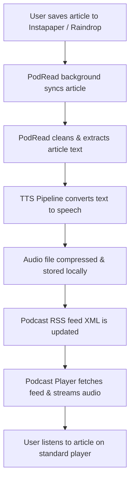

# Product Requirements Document (PRD)
## Project: PodRead (Read-it-Later Podcast Generator)

---

### 1. Executive Summary & Vision

**PodRead** is a self-hosted, lightweight utility that automatically bridges the gap between text-based "read-it-later" services (such as Instapaper, Raindrop.io, and Pocket) and audio-based podcast players (such as Overcast, Pocket Casts, and Apple Podcasts). 

The goal of PodRead is to convert saved text bookmarks into highly natural speech audio files and serve them via a standard, secure podcast RSS feed. This allows users to listen to their personal reading list on the go using their standard podcast app, with support for local offline-first TTS generation (using state-of-the-art models like Kyutai Labs' **Pocket TTS** and **Piper TTS**) or zero-config cloud-based options.

---

### 2. User Journey & Use Cases



#### Key Use Cases
*   **Commuting & Multi-tasking**: Listen to long-form journalism, technical blog posts, or essays while driving, walking, or doing chores.
*   **Local & Private Synthesis**: For privacy-conscious users, perform all TTS processing on a local CPU (using Pocket TTS or Piper) without sending contents to third-party APIs.
*   **Zero-Setup Out-of-the-Box**: Quick onboarding using cloud-based free synthesis (Edge TTS) and simple tokens before configuring heavier local ML pipelines.
*   **Standard Podcast client integration**: No custom player app needed; works instantly with existing podcast clients via a private RSS link.

---

### 3. Read-it-Later Service Integrations

To get articles, PodRead will support multiple services. The following table compares integrations to help the user choose their backend:

| Metric / Feature | **Instapaper** (User Choice) | **Raindrop.io** (Recommended Alternative) | **Pocket** (Alternative) |
| :--- | :--- | :--- | :--- |
| **API Ease of Use** | **Medium-Hard**: Full API requires OAuth 1.0a with custom HMAC-SHA1 signatures. | **Excellent**: Simple REST API using static personal "Test Tokens" created in 5 seconds. | **Medium**: Standard REST API using OAuth 2.0 flow. |
| **Developer Access** | **Restricted**: Requires submitting a web form for `Consumer Key` and waiting for manual approval. | **Instant**: Developer console is open and accessible immediately under account settings. | **Instant**: Instant developer key creation in the Pocket console. |
| **Article Extraction**| Standard HTML or text. Requires third-party scraper for full content if using bookmark sync. | **Built-in**: Raindrop parses and stores clean text, HTML, and markdown of articles out-of-the-box. | Standard URLs; requires full webpage extraction using custom logic. |
| **RSS Feeds** | Available for premium users, but text-only, not audio-friendly. | Has built-in public and private RSS feeds of folders/collections. | Basic bookmark feed, requires parsing. |

> [!TIP]
> **Recommendation**: While we will support **Instapaper** as requested, we strongly recommend implementing **Raindrop.io** as the default or first integration due to its instant developer access, personal token system, and built-in full-text parser. We will construct a pluggable integration adapter that supports both!

---

### 4. Text-To-Speech (TTS) Engine Architecture

PodRead will implement a pluggable audio synthesis system. Users can toggle between three engine tiers in their settings:

#### A. Pocket TTS (Kyutai Labs)
*   **Type**: Offline, local neural TTS (Continuous Audio Language Models - CALM framework).
*   **Specs**: 100M parameter model, highly CPU-optimized, runs faster than real-time on consumer laptop CPUs.
*   **Special Feature**: **Voice Cloning** — can clone any voice from a 5-second WAV reference audio file (perfect for matching your own voice, or your favorite narrator).
*   **Pros**: Incredible naturalness, offline privacy, multilingual support (EN, FR, DE, ES, PT, IT).
*   **Cons**: Requires Python ML setup (PyTorch/ONNX dependencies).

#### B. Piper TTS
*   **Type**: Offline, fast local neural text-to-speech.
*   **Specs**: ONNX runtime-backed, optimized for low-end hardware (Raspberry Pi 4 / standard CPU).
*   **Voices**: Extremely diverse library of hundreds of pre-trained voices across multiple languages/accents.
*   **Pros**: Fast execution, zero internet required, extremely stable CLI and Python library integration.
*   **Cons**: Voices sound more mechanical than Pocket TTS, lacks built-in zero-shot voice cloning.

#### C. Edge TTS (Alternative option)
*   **Type**: Online, cloud-based free text-to-speech.
*   **Specs**: Leverages Microsoft Edge's hidden Read-Aloud API via python wrapper `edge-tts`.
*   **Pros**: **Zero configuration**, incredibly high-quality neural voices, extremely fast, completely free, requires no model downloads or heavy PyTorch installations.
*   **Cons**: Requires active internet connection, sends article text to Microsoft servers.

---

### 5. Technical Stack & Architecture

#### Core Tech Stack
1.  **Backend & Pipeline**: **Python 3.10+ (FastAPI)**
    *   *Why?* The local ML engines (Piper, Pocket TTS) are Python-native or Python-friendly. Using FastAPI provides a high-performance web server, simple background tasks for audio generation, and easy SQLite interfacing.
2.  **Database**: **SQLite** with **SQLAlchemy/SQLModel**
    *   To keep the app self-contained, lightweight, and zero-config.
3.  **Frontend Dashboard**: **Modern SPA (Vite + React or pure Vanilla JS + CSS)**
    *   *Why?* Sleek, high-performance interface. Vanilla JS and raw CSS with glassmorphism aesthetics keep the application extremely portable and fast to serve directly from the FastAPI backend.
4.  **Audio Processing**: **FFmpeg / pydub**
    *   For stitching intro/outro audio, converting raw WAV to space-efficient MP3 (or AAC), and normalizing audio volume.

#### Directory & Data Flow
*   **`/audio/`**: Serves generated MP3 files.
*   **`/rss.xml`**: Dynamically serves the podcast feed.
*   **`/db.sqlite`**: Stores bookmarks, sync times, and configuration settings.

---

### 6. Functional & Non-Functional Requirements

#### Feature 1: The Sync & Extraction Engine (Backend)
*   **Polled / Triggered Sync**: Connects to the Instapaper / Raindrop API and fetches new bookmarks.
*   **Article Parser**: Using python libraries (`readability-lxml`, `beautifulsoup4`, or `newspaper3k`), extracts the core text body, removing navigation panels, ads, social sharing widgets, and headers.
*   **Content Chunking**: Splits articles into logical paragraphs or sub-1000-character segments to ensure smooth synthesis without overloading the TTS engines.

#### Feature 2: Audio Synthesis Pipeline (Backend)
*   **Job Queue**: Processes text-to-speech tasks in a background thread to prevent blocking the UI.
*   **Stitched Intros**: Prepends a short programmatic intro: *"Welcome to PodRead. Reading: [Title] by [Author], published in [Domain]."*
*   **Format Transcoder**: Encodes the output into constant bitrate (CBR) MP3 format (96-128kbps, mono) optimal for voice podcasts to save bandwidth and storage.

#### Feature 3: Podcast Feed Server
*   **Standard Compliance**: Generates a valid RSS 2.0 feed complying with iTunes/Apple Podcasts standards.
*   **Enclosures**: Includes `<enclosure>` tags with absolute HTTP URLs pointing to the local `/audio/<id>.mp3` endpoints.
*   **External Access**: Provides instructions on using tunneling services (e.g. `ngrok`, `localtunnel`, or `Tailscale`) so podcast apps on mobile phones can download and stream audio from the local machine.

#### Feature 4: Premium Web Dashboard (Frontend)
*   **Visual Style**: Sleek modern dark mode using deep HSL color gradients, glassmorphism panel backgrounds, and crisp modern typography (Outfit / Inter).
*   **Active Bookmark Feed**: View synced bookmarks with cards indicating status (`Unprocessed`, `In Queue`, `Synthesizing`, `Ready to Listen`, `Failed`).
*   **Manual Trigger**: Click "Regenerate" or "Sync Now" buttons.
*   **Audio Player**: Sleek embedded HTML5 custom audio player with playback speed controllers (1.0x, 1.25x, 1.5x, 1.75x, 2.0x).
*   **Settings Panel**: 
    *   Configure APIs (Instapaper credentials or Raindrop test tokens).
    *   Choose TTS Engine (Pocket TTS, Piper, Edge TTS).
    *   Drop-down list of available voices.
    *   Upload Reference Audio (5s WAV) for Kyutai Pocket TTS voice cloning.
    *   One-click "Copy RSS Feed URL".

---

### 7. Proposed System Architecture

```
                    +------------------------------------+
                    |        External Services           |
                    |  - Instapaper API                  |
                    |  - Raindrop.io API                 |
                    +-----------------+------------------+
                                      |
                                      v
+-------------------------------------+-----------------------------------+
|                           PodRead Backend (FastAPI)                     |
|                                                                         |
|  +--------------------+   +---------------------+   +----------------+  |
|  |  Bookmark Syncer   |-->|   Content Parser    |-->| SQLite DB      |  |
|  +--------------------+   +---------------------+   | (SQLModel)     |  |
|                                                     +--------+-------+  |
|                                                              |          |
|  +-----------------------------------------------------------+          |
|  |                                                                      |
|  v                                                                      |
|  +--------------------+   +---------------------+   +----------------+  |
|  |  Audio Pipeline    |-->| TTS Adapter         |-->| Local Audio    |  |
|  |  (Background Queue) |   | (Pocket/Piper/Edge) |   | Store (.mp3)   |  |
|  +--------+-----------+   +---------------------+   +--------+-------+  |
|           |                                                  |          |
|           v                                                  v          |
|  +--------------------+                             +----------------+  |
|  | RSS XML Generator   |<----------------------------| Static Server  |  |
|  +--------+-----------+                             +--------+-------+  |
|           |                                                  |          |
+-----------|--------------------------------------------------|----------+
            | (Serves RSS Feed)                                | (Serves MP3 files)
            v                                                  v
+-----------+-----------+                             +--------+-------+
|  Standard Podcast     |                             | Sleek Web      |
|  Client (Overcast/etc)|                             | Dashboard      |
+-----------------------+                             +----------------+
```

---

### 8. Phased Implementation Roadmap

#### **Phase 1: Foundation & Simple Cloud MVP (Fastest Path)**
*   Setup basic Python FastAPI project layout.
*   Implement Raindrop.io sync with personal access token (e.g. Test Token) as the default provider.
*   Integrate `newspaper3k` or `readability-lxml` for clean text parsing.
*   Integrate **Edge TTS** (zero-config, high quality) as the initial audio pipeline.
*   Write basic dynamically generated `rss.xml` builder.
*   **Outcome**: User can subscribe to feed on their local network or via ngrok, fetch Raindrop bookmarks, generate audio, and listen on standard podcast player.

#### **Phase 2: Local AI TTS Integration (Piper & Pocket TTS)**
*   Implement pluggable TTS adapter system.
*   Integrate **Piper TTS** with model auto-downloading helper.
*   Integrate **Kyutai Labs Pocket TTS** (with optional 5-second reference voice cloning configuration).
*   Add a local background process queue to handle heavier CPU audio generation.
*   **Outcome**: Zero-internet, completely offline-capable audio generation with custom voice cloning.

#### **Phase 3: Additional Read-it-Later Providers (Instapaper & Pocket)**
*   Implement OAuth 1.0a flow and API integration for **Instapaper** full bookmark, sync, and extraction support.
*   Implement OAuth 2.0 flow and API integration for **Pocket**.
*   Design a pluggable read-it-later integration adapter pattern to easily scale to future backends.
*   **Outcome**: Full support for all three major read-it-later systems.

#### **Phase 4: Optimization, Multi-Platform & Packaging**
*   Add Dockerfile for easy multi-arch deployments (x86 and ARM64/Raspberry Pi).
*   Incorporate automatic audio trimming, silence removal, and background sound mixing.
*   Setup simple scripts for tailscale or ngrok setup guides.
*   **Outcome**: High performance, easy multi-device deployment, and robust production delivery.

#### **Phase 5: Premium UI Web Dashboard**
*   Create a jaw-dropping glassmorphism dashboard in Vanilla CSS/JS (styled to look like a premium SaaS application).
*   Add responsive layouts for desktop and mobile.
*   Build an interactive local player, live logs visualizer, and settings management forms.
*   **Outcome**: A polished, beautiful, self-contained app ready for self-hosting with rich, intuitive controls.
